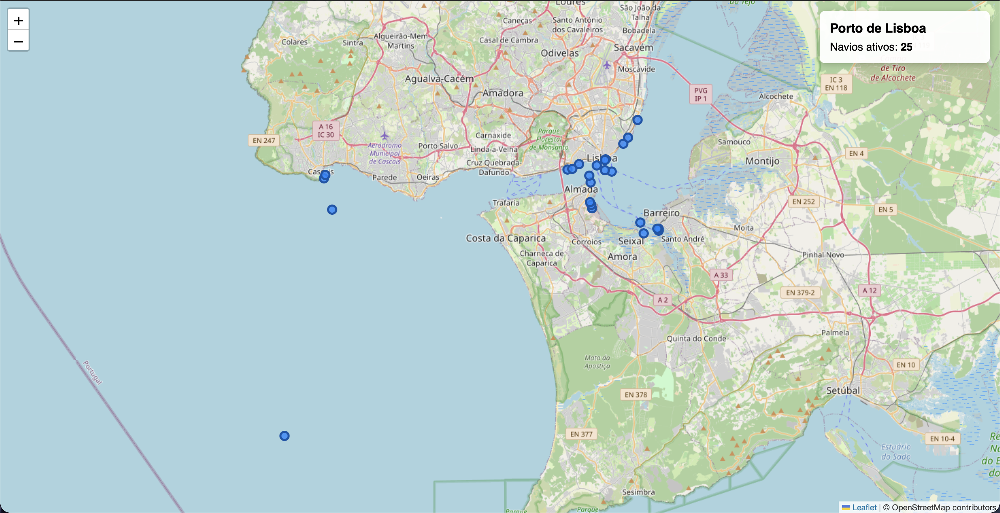

# 🚢 Lisbon Maritime Traffic Dashboard



A real-time web dashboard that monitors maritime traffic in the Port of Lisbon and the Tagus River estuary. The application establishes a WebSocket connection to fetch live AIS (Automatic Identification System) data and plots active vessels on an interactive map.

## ✨ Features
* **Real-Time Tracking:** Live position updates of vessels using the AISStream WebSocket API.
* **Interactive Map:** Built with Leaflet.js and OpenStreetMap tiles.
* **Dynamic Markers:** Interactive ship markers displaying the vessel's Name, MMSI, Speed over Ground (SOG), and Course over Ground (COG).
* **Geographic Filtering:** Data is strictly filtered using a custom bounding box focused on the Lisbon coastal area to ensure optimal browser performance.

## 🛠️ Technologies Used
* HTML5 / CSS3
* Vanilla JavaScript
* [Leaflet.js](https://leafletjs.com/) (Web Mapping)
* [AISStream.io](https://aisstream.io/) (WebSocket Data Provider)

## 🚀 How to Run Locally

1. Clone this repository:
   ```bash
   git clone [https://github.com/Diogo5059/nome-do-teu-repositorio.git](https://github.com/Diogo5059/nome-do-teu-repositorio.git)
2. Create a free account at AISStream.io to get an API key.
3. Open the index.html file in your text editor and replace "API-KEY" with your actual API key.
4. Open the index.html file in any modern web browser. No local server is required!

👨‍💻 Author
Diogo Amaral - https://www.linkedin.com/in/diogo-amaral-196a142b2/